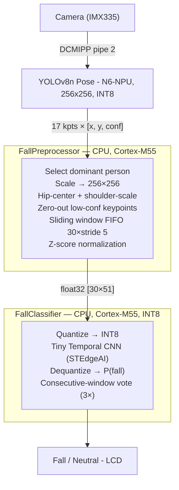

# Edge-Fall-Detection (MCU)

Two-stage fall detection on the STM32N6570-DK evaluation board.

## Fork Base

- Fork of ST's [x-cube-n6-ai-multi-pose-estimation](https://github.com/STMicroelectronics/x-cube-n6-ai-multi-pose-estimation)
- Upstream: real-time multi-person YOLOv8 pose estimation using the STM32N6 NPU
- This fork adds a second CPU inference stage for fall/neutral classification

## What Was Added

- **FallDetector module** on top of the unmodified upstream pose pipeline
- Classifies pose sequences as `fall` / `neutral` using a small temporal CNN
- Model trained in the companion [`learning/`](https://github.com/SchaeferDa/edge-fall-detection-learning) pipeline and is integrated with the combined repository [edge-fall-detection](https://github.com/SchaeferDa/edge-fall-detection)
- Repository is part of the main project [MasterProjekt_SS26](https://github.com/d72gq2sj52-cmd/MasterProjekt_SS26)

### Two-Stage Architecture



- Preprocessing mirrors the training pipeline exactly (same normalization order, Z-score params, window/stride)
- Z-score parameters embedded in `Inc/fall_scaler_data.h` (auto-generated from `scaler.npz`)

### Added Files

| Path | Description |
|---|---|
| `FallDetector/Src/fall_preprocessor.c/h` | Pose normalization, sliding window, Z-score |
| `FallDetector/Src/fall_classifier.c/h` | STEdgeAI INT8 inference wrapper, vote filter |
| `FallDetector/Model/fall_network.c/h` | Model generated by STEdgeAI from `model_int8.tflite` |
| `FallDetector/Model/fall_network_data.c` | Model weights (pre-allocated in flash) |
| `FallDetector/fall_detector.mk` | Makefile fragment — included by the root `Makefile` |
| `Inc/fall_scaler_data.h` | Auto-generated Z-score mean/std arrays (from `scaler.npz`) |

### Key Parameters

| Parameter | Value | Description |
|---|---|---|
| `FALL_SEQ_LEN` | `30` | Sliding window length (frames) |
| `FALL_STRIDE` | `5` | Run classifier every N frames |
| `FALL_FEATURES` | `51` | 17 keypoints × 3 (x, y, conf) |
| `FALL_CONF_THRESH` | `0.3` | Keypoint confidence threshold |
| `FALL_SHOULDER_HIST` | `90` | Rolling-median history depth for scale (~3 s at 30 fps) |
| `FALL_DET_THRESHOLD` | `0.5` | P(fall) decision threshold |
| `FALL_CONSECUTIVE_WIN` | `3` | Consecutive positive windows required before triggering |

## Project Structure

```text
├── FallDetector/          # Fall detection module (added in this fork)
│   ├── Src/               #   Preprocessor and classifier implementation
│   └── Model/             #   STEdgeAI-generated network code and weights
├── Inc/                   # Application header files (incl. fall_scaler_data.h)
├── Src/                   # Application source files (app.c, main.c, …)
├── Model/                 # YOLOv8 pose model weights (network_data.hex)
├── FSBL/                  # First Stage Boot Loader hex
├── Binary/                # Prebuilt flashable binary
├── Doc/                   # Detailed documentation
├── STM32CubeIDE/          # IDE project files
├── EWARM/                 # IAR project files
├── Gcc/                   # Linker scripts for GCC/Makefile build
├── build.sh               # Convenience build script (GCC toolchain)
└── flash.sh               # Convenience flash script (STM32CubeProgrammer)
```

## Hardware

- **Board:** MB1939 STM32N6570-DK
  - ST-LINK CN6 via USB-C to USB-C (required for sufficient power)
- **Camera:** MB1854B IMX335 (default, included with board)

## Tools

| Tool | Version |
|---|---|
| STM32CubeIDE | 2.1.1 |
| STM32CubeProgrammer | 2.18.0 |
| STEdgeAI | 3.0.0 |
| GCC (arm-none-eabi) | 14.3 rel1 (bundled with STM32CubeIDE) |

## Boot Modes

- No internal flash - firmware must be written to external flash to survive power cycle

| Mode | Boot switches | Use case |
|---|---|---|
| Dev mode | Both to the **right** | Load via debug session (RAM only, lost on power off) |
| Boot from flash | Both to the **left** | Normal operation after flashing |

## Build

```bash
./build.sh          # GCC via Makefile (recommended)
make -j8            # directly
```

- STM32CubeIDE: open `STM32CubeIDE/.project`, use build button

## Deploying the Model

- YOLOv8 pose model: download and convert first - see [Doc/Download-and-deploy-model.md](Doc/Download-and-deploy-model.md)
  - Generate using script [Model/generate-n6-model.sh](Model/generate-n6-model.sh)
- Fall detection model: generated by STEdgeAI from `model_int8.tflite` (output of `learning/quantization/`)
  - Generate using script [FallDetector/Model/generate-fall-model.sh](FallDetector/Model/generate-fall-model.sh)
- After regenerating the model, also update the scaler header:

```bash
python tools/gen_scaler_header.py ../learning/training/checkpoints/scaler.npz
```

## Flash

```bash
# 1. Both boot switches to the right
./flash.sh
# 2. Both boot switches to the left
```

The script flashes three components in order:
- `FSBL/ai_fsbl.hex` — First Stage Boot Loader
- `Model/network_data.hex` — YOLOv8 weights
- `build/Project_sign.bin` at `0x70100000` — signed application

## Serial Console

- Baud rate: `115200`, no parity, 1 stop bit
- Connect to ST-LINK virtual COM port

## Further Documentation

- [Application Overview](Doc/Application-Overview.md)
- [Boot Overview](Doc/Boot-Overview.md)
- [Camera Build Options](Doc/Build-Options.md)
- [Download and Deploy Model](Doc/Download-and-deploy-model.md)

## References

- Upstream project: [x-cube-n6-ai-multi-pose-estimation](https://github.com/STMicroelectronics/x-cube-n6-ai-multi-pose-estimation)
- STM32N6570-DK: https://www.st.com/en/evaluation-tools/stm32n6570-dk.html
- STEdgeAI: https://www.st.com/en/development-tools/stedgeai-core.html
- YOLOv8 Pose: https://docs.ultralytics.com/tasks/pose/
